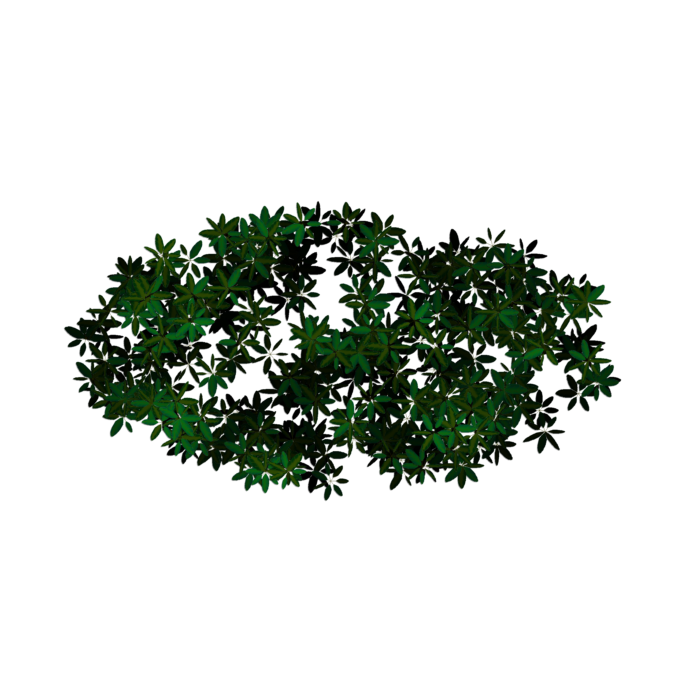
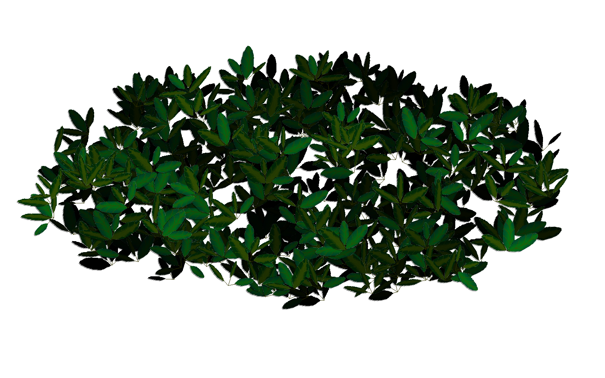

# Foliage Generator

A simple python script to combine images of leafs into a randomized dense foliage in any given shape. Optionally adds a depth effect by 
changing the tone of the leaves and including cast shadows.

# Examples
`im = createTree3(loadImages('leaf-b-', 4), 2500, 2500, createCircle(1200, 1200, 1000, 1000, 20),
                 leaves_per_bunch=4, distance_to_center=40, quantity=1500, shadow=True)
display(im)
`

`im = createTree3(loadImages('leaf-b-', 4), 1600, 1000, createCircle(800, 500, 700, 300, 20),
                 leaves_per_bunch=7, distance_to_center=45, quantity=360, shadow=True, half_circle=True, phase=4,
                minRotation=-45, maxRotation=45)
display(im)
`

